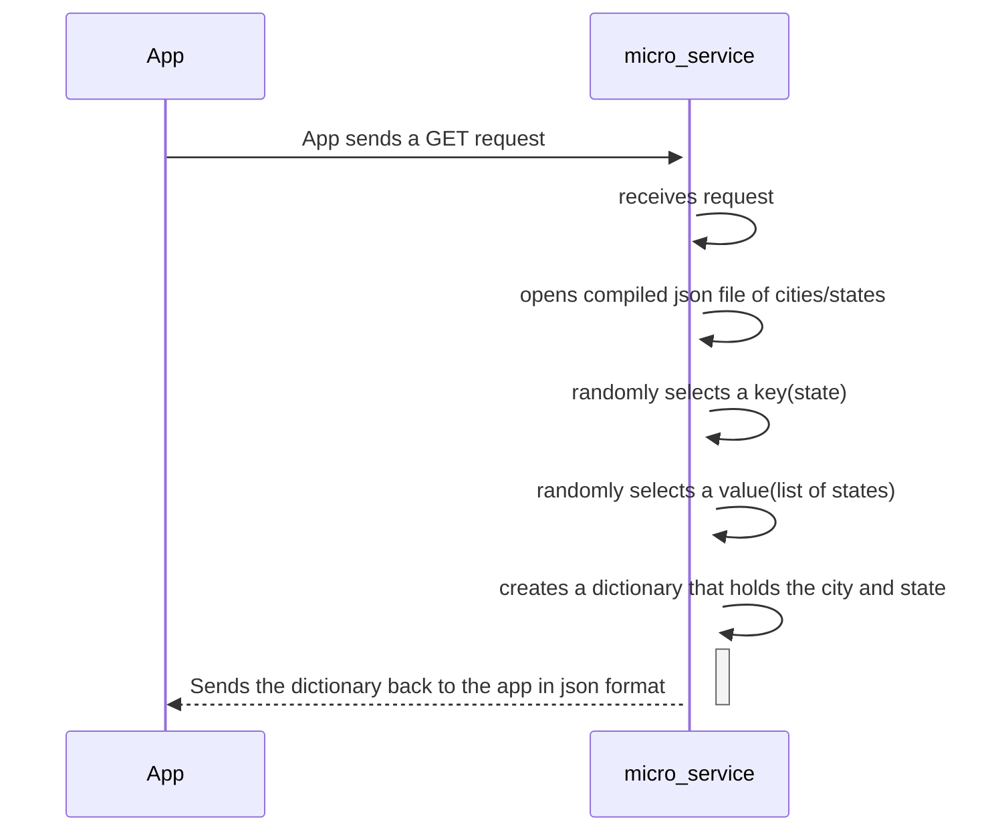

So I wrote this so that it really shouldn't matter what language you are coding in because you send a GET request and that is all that matters to the microservice.

I created a flask micro server that once ran, will just continue to run until you forcibly stop it. Any time the server receives a GET request it opens a json file that is a dictionary. 

Each state plus District of Columbia are the keys, and the values for each are a list of cities. The server generates a random number from the number of keys and selects a random key. 

then it generates a random number based on the number of cities in that key's values and randomly selects a city. 

It then creates a response dictionary variable with the city and state as keys and the corresponding values as their values. The file gets closed. It sends this back as the response to the GET request. 

Because the server doesn't quit unless you tell it to, you can send as many GET requests as you want and it will generate a new city/state each time. 

The list of cities for each state was tremendously larger but I had problems with memory being able to load it all, so I cut down the lists until it was within memory capacity.

# SETUP INSTRUCTIONS-----------------

Download the 'micro_server.py' file and add it to your folder

Download the 'cities.json' file and add it to your folder

Open the micro_server.py file and in line 15 is the following line of code:

with open("./CS-361/cities.json",'r') as file:

Inside the quotation, replace ./CS-361 with the filepath to where you placed the cities.json file

In order to grab the information make sure that you are assigning a variable in your main program to the results of the GET request.

micro_server = 'http://127.0.0.1:5001/cities'   

#this is where to send your GET request once the microservice server is running. It's set to a different port than the default so it shouldn't                                                
#conflict with your flask server unless you happen to have used the same port

#above code also declares location of where the get request is being sent, it is a local host address
# This is done in Python language but the concept is similar in most other languages.

 #example of assigning a variable to the response of the get request being sent to the microservice . The response is automatically received from the server because the server performs it's actions and sends the response back. assigning a variable puts that response into a container.
 
response = requests.get(micro_server) 

code = response.json()                
#converting the code to json format and assigning it to a new variable for use in the program

---------------------------------------------
## UML Diagram

